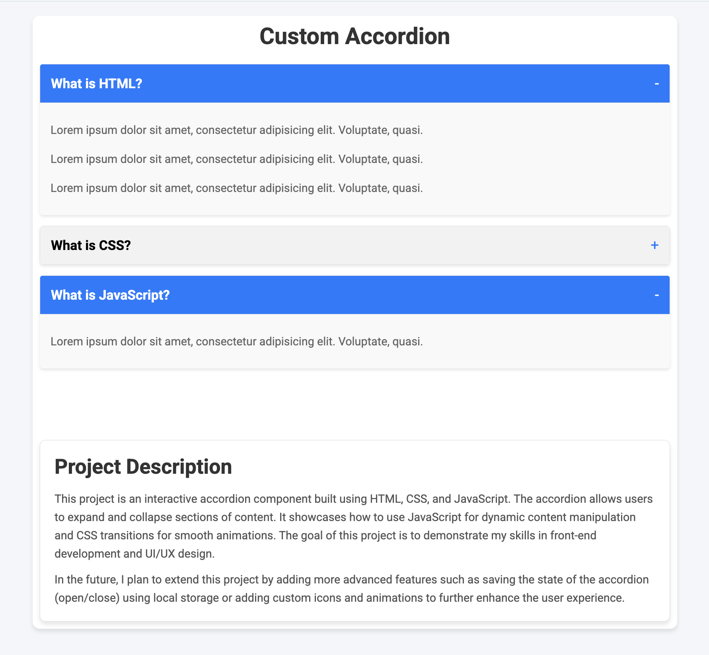

# Custom Accordion Component

## Overview

A lightweight, responsive accordion component built with HTML, CSS, and vanilla JavaScript. This project demonstrates how to create an interactive UI element that allows users to expand and collapse content sections with smooth animations.

## Preview

## Features

- Clean, modern design with subtle shadows and rounded corners
- Smooth transitions when opening and closing accordion panels
- Visual indicators (plus/minus icons) that change based on accordion state
- Fully responsive layout that works on all device sizes
- No external dependencies - built with pure HTML, CSS, and JavaScript

## Technologies Used

- HTML5
- CSS3 (with transitions and flexbox)
- Vanilla JavaScript
- Google Fonts (Roboto)

## How It Works

The accordion uses JavaScript to toggle CSS classes that control the visibility and styling of content panels. When a user clicks on an accordion title:

1. The content panel expands/collapses with a smooth animation
2. The title background changes color to indicate the active state
3. The plus/minus icon toggles to reflect the current state

## Future Enhancements

- Save accordion state using localStorage
- Add keyboard navigation for accessibility
- Implement option to have multiple panels open simultaneously
- Add more customization options for colors and animations

## Usage

Simply clone the repository and open the index.html file in your browser to see the accordion in action. The code is well-commented and can be easily customized to fit your specific needs.
